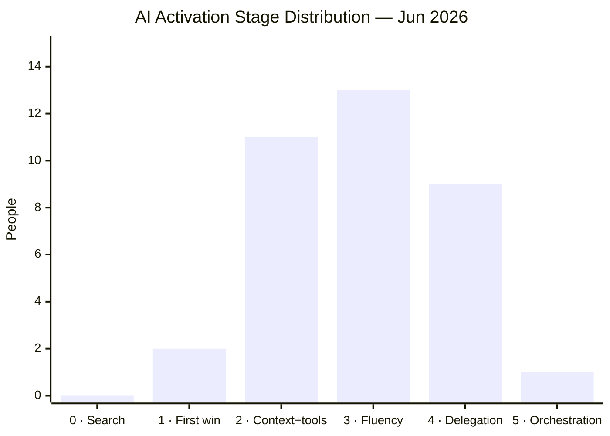

# AI Activation Map

Stage distribution across the company, based on observed behaviour in meetings and 1:1s. See [[activation-pathway]] for full stage definitions and [[ai-activation]] for the initiative tracking the June deadline.

**Confidence markers:** (M) = medium, (L) = low. No marker = high confidence.  
Last updated: 2026-06-12.

---

## Stage × Department

|  | Engineering | Product | Operations | Finance / Pricing | Distribution | Underwriting | People | Leadership |
|--|-------------|---------|------------|-------------------|--------------|--------------|--------|------------|
| **5 · Orchestration** | [[ishmael]] | | | | | | | |
| **4 · Delegation** | [[javier]] (M) · [[stephen-millington]] · [[jordi]] (M) | [[mima]] · [[ollie-crowe]] (M) | [[emily]] | [[francesco-venerandi]] | [[matt-lees]] · [[adam-smith]] | | | |
| **3 · Fluency** | [[rob]] (M) · [[chris]] (M) · [[david]] (L) · [[jacob-holland]] (M) · [[ivan-boix]] · [[kevin-berg]] · [[aleks-yanova\|Aleks]] (M) | [[matt]] (M) | [[shreya-chowta]] · [[anna]] (M) | [[kirsty]] (M) | [[alex-dyball]] (M) · [[jake-wood]] (M) | | | [[fergus]] (L) |
| **2 · Context+tools** | [[sam]] (M) | [[geran]] (M) | [[jonny-smith]] (L) | [[jade-mounir]] (M) · [[matt-dipre]] (M) · [[milan-chavda]] (M) · [[anneliese-vanwijk]] (M) | [[sophie-dodds]] · Liam (M) | [[tom-rogers]] (M) | | [[ed]] |
| **1 · First win** | | | [[fred-bush]] (M) | [[queency-gonsalves]] (M) | | | | |
| **0 · Search** | | | | | | | | |
| **?** | [[sami]] | | | David P · Pavel | [[ben-allen]] (L) · [[daisy-mae-baker]] (L) | Darren N · Lawrence · Michael M · Andrew · Billy · Curtis · Matt S · Harry | [[eraaz-ali]] · [[phoebe-woodman]] | Antton · [[darren]] · Christian · [[paul]] · [[rakhee]] |

*David (engineering) on paternity leave. Connie + Navani on maternity leave. Alex Smith + Abs Lamzini left.*

---

## Distribution (current)

*Assessed: ~36 people. Unassessed / insufficient data: ~20. On leave: 3. Company size: ~70.*

---

## Progression — movers with before/after evidence

People where multiple conversations show measurable stage movement this year.

| Person | Start | Now | Movement | Key moment |
|--------|-------|-----|----------|------------|
| [[shreya-chowta]] | Stage 1 (Apr 2) | Stage 3 | +2 in 6 weeks | Built + shipped NOC skill independently — Apr 14. Fastest non-engineering progression. |
| [[kirsty]] | Stage 2 (Apr 9) | Stage 3 | +1 | Built Looker→Claude MCP; distributed across finance + distribution. Tool with reach. |
| [[ivan-boix]] | Stage 2 (May 13) | Stage 3 | +1 | Made the co:work conceptual leap — Jun 2. Credit control cycle now runs daily. |
| [[alex-dyball]] | Stage 2 (Apr 10) | Stage 3 | +1 | Coaching others on AI use by May 26. |
| [[adam-smith]] | Stage 3 (Apr 2) | Stage 4 | +1 | Secretary → coach → strategic partner pattern confirmed May 27. Using AI on complex stakeholder navigation. |
| [[jake-wood]] | unassessed | Stage 3 | — | Zero to building a HubSpot deal-tracking system in one day (Jun 1), unprompted. Peer demo was the trigger. |
| [[sophie-dodds]] | Stage 1 (Apr 13) | Stage 2 | +1 | Motivated; progressing with support. Custom Granola template is the unlock. |
| [[jade-mounir]] | Stage 1 (May) | Stage 2 | +1 | Finance workshop May 19; team-based learning approach working. |

**Pattern:** Stage 2 → 3 is the most common movement. The trigger is consistently a concrete task win in their own domain, not a workshop. Peer demos (Jake) and pairing (Ivan, Shreya) outperform generic sessions.

---

## Notes

- **Ishmael** is the engineering ceiling: PromptFoo evals, DataDog LLM observability, Bedrock Agent Core memory — this is Stage 5 in practice.
- **Emily** is the ops reference model: designs processes with AI from the start, ChatGPT + Claude daily, HubSpot + Zapier automation pipelines. Ceiling of what Stage 4 looks like for an ops practitioner.
- **Francesco** is the closest non-engineering Stage 5 candidate: MCP-based performance coach (Granola + Slack + Notion + GCal), J pipeline, pricing automation hackathon planned. Wants to "build AI systems" — that's the Stage 5 orientation.
- **Matt Lees** is the highest Stage 4 outside engineering: 9 scheduled autonomous agents, 600-company pipeline, MEDDPICC scoring. Over-engineering tendency is the Stage 4→5 block — not yet measuring adherence.
- **Rob** is Stage 3 with a confirmed failure mode — takes output at face value, skips pre-thinking. Needs targeted critical thinking support.
- **Shreya** is Stage 3 (high confidence) — built and shipped the NOC skill independently, shares with her team. Fastest non-engineering progressor.
- **Chris** is Stage 3 (medium confidence, data from March) — Head of Architecture with system-level thinking. Likely understated — priority for reassessment.
- **David Zamora** is Stage 3 (low confidence, single observation) — multiple Cursor windows simultaneously from Dev AI Practices transcript.
- **Jacob Holland** is Stage 3 (medium confidence, one group session) — cron-based automated documentation agents, DBT golden rules enforcement. Strong Stage 4 candidate if depth is confirmed.
- **Ed** is blocked at Stage 2 by MCP auth friction. Philosophically ahead of his current practice level.
- **Fergus** is low confidence — strategic endorser and technically capable but limited evidence of personal daily AI tooling.
- **Kirsty** built Looker→Claude MCP used across finance and distribution — data from April, likely progressed.
- **Jake Wood** built a HubSpot deal-tracking automation in a single day (unprompted, post-demo). Peer demo was the trigger — confirms underwriter activation pattern.
- **Anna** (ops) data from April — likely Stage 3 by now given ops team trajectory. Reassess soon.
- **Tom Rogers** is Stage 2 (medium confidence, Apr 16): power Looker user, uses AI personally (loaded 5-6 years of claims data), active seeker — but team is "amateur level" and he's burned by ChatGPT on Excel. The claims-listing analysis prototype is the trust-rebuilding moment. Not defensive; concrete ask in hand.
- **Liam Thomson** is Stage 2 (medium confidence, Apr 10): thoughtful multi-tool user (ChatGPT with custom instructions, Claude for complex thinking, Lovable for decks), never uses output directly, tests rigorously. No pipelines — generalist role makes automation harder to identify. Deck creation is the clearest next unlock.
- **Darren McCauley** is using AI more than he lets on — Tom Rogers confirmed: screenshots summarising broker performance, triangulating telemetry/loss-rate data. The strategic skeptic framing may be overstated. Still unassessed directly.
- **Aleks Yaneva** is Stage 3 (medium confidence, Jun 12 assessment) — ran multi-agent document processing pipelines for 1.5 days, daily Cursor + Claude Code use, strong critical thinking about AI limitations (demands sources, challenges outputs). Cynicism is philosophical ("I don't want to be a prompt jockey", grief not fear), not a capability block. Failure mode: in unfamiliar domains, trusts Claude 100% without verification — same structural gap as Rob but different cause. Group therapy session attendee Jun 3.
- **Milan Chavda** is Stage 2 (medium confidence, Jun 12 assessment, two 1:1s) — daily co-work use, built actuarial/triangle skills, team whiteboard session on automation opportunities. Thoughtful and critical about AI (reads emails/articles in full; resists brain rot). Blocker is time and setup, not mindset. Second brain/personal OS is the identified next step; Jun 16 workshop is the unlock.

---

## Not yet assessed

People in the **?** row have insufficient data for a reliable assessment.

**Priority conversations — strategic or structural importance:**
- **Antton Pena** (CCO, Leadership) — Fergus routes comms through him; no AI data. Second most senior person in the company.
- **Darren McCauley** (CUO, Leadership) — Tom Rogers confirmed he's using AI more than he lets on (screenshots, data triangulation). The strategic skeptic framing may be overstated. Highest-priority unassessed person for the underwriting activation.
- **Darren Nightingale** (Head of Underwriting) — no direct conversation; leads all underwriters day-to-day.
- **Lawrence Tanner** (Claims Operations) — leaving the business soon; drop from evaluation scope.
- **Michael Matthews** (Head of Actuarial) — no AI usage data; actuarial team unassessed.
- **Christian Nielsen** (CFO, Leadership) — no AI data; finance AI adoption is already advanced in his team but not at his level.
- **Paul O'Neill** (Head of Risk and Compliance) — no AI usage data at all; risk/compliance lens on AI governance is a gap.
- **[[sami]]** (Engineering) — Jordi flagged as not AI-driven Apr 2026; 30-day goal was set. Follow up with Jordi on outcome, then 1:1.

**Files created, some inference:**
- **[[ben-allen]]** / **[[daisy-mae-baker]]** — team-level Granola setup confirmed but no data on personal practice. Stage 2 is an inference.
- **[[eraaz-ali]]** (Talent/People) — Stage 2 assessed from file data; no direct 1:1 since April.
- **[[phoebe-woodman]]** (People) — no AI usage data; people-partner adjacent role.
- **Rakhee Gohil** (People) — met Jun 9; discussed adoption culture and framing. No personal AI practice assessment yet.

**Whole-team gaps — no individual data at all:**
- **Claims team** (Adam Sandle) — Lawrence Tanner leaving; Adam Sandle is the remaining claims associate. Low priority given team size.
- **Underwriting ICs** (Billy Bone, Curtis Bailey, Matt Smith, Andrew Dodd, Harry Dowrick) — Jake Wood is the only assessed underwriter IC; these five have no data.
- **Finance ICs** (David Pilley, Pavel Souliman) — junior finance; Kevin/Ivan/Anneliese assessed but not these two.

**Out of scope / exempt:**
- Craig Hill (IT Manager), Gina Payne (EA) — not included in activation programme scope.

**Left the company:**
- Abs Lamzini (Engineering), Alex Smith (Engineering)

*Ivan Boix and Kevin Berg: assessed Stage 3 (high confidence) — moved out of this section.*
*Aleks Yaneva: moved to Stage 3 (M) following transcript review Jun 12.*
*Milan Chavda: confidence upgraded from (L) to (M) following second 1:1 Jun 12.*
