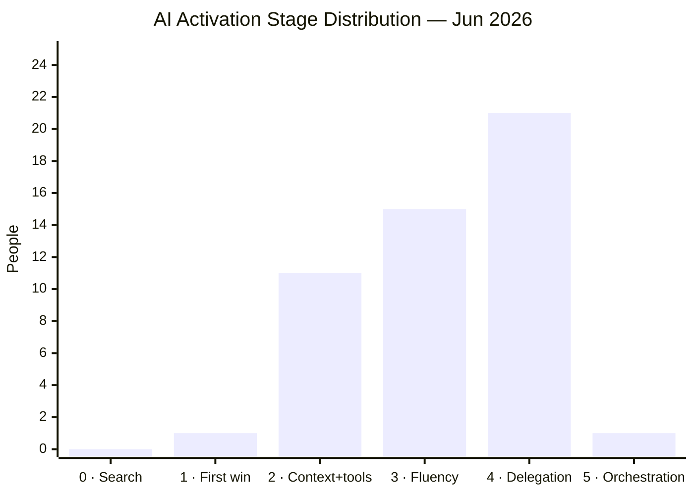

# AI Activation Map

Stage distribution across the company, based on observed behaviour in meetings and 1:1s. See [[activation-pathway]] for full stage definitions and [[ai-activation]] for the initiative tracking the June deadline.

**Confidence markers:** (M) = medium, (L) = low. No marker = high confidence.  
Last updated: 2026-06-25. See [[ai-activation-assessment-2026-06]] for full evidence and pull quotes.

---

## Stage × Department

|  | Engineering | Product | Operations | Finance / Pricing | Distribution | Underwriting | People | Leadership |
|--|-------------|---------|------------|-------------------|--------------|--------------|--------|------------|
| **5 · Orchestration** | [[ishmael]] | | | | | | | |
| **4 · Delegation** | [[jordi]] · [[david]] (M) · [[javier]] · [[jacob-holland]] · [[stephen-millington]] · [[sam]] (M) · [[aleks-yanova\|Aleks]] (M) · [[chris]] · [[rob]] (M) | [[mima]] · [[ollie-crowe]] · [[matt]] (M) · [[geran]] | [[emily]] · [[shreya-chowta]] | [[kirsty]] · [[christian-leth-nielsen\|Christian]] | [[matt-lees]] · [[adam-smith]] | [[francesco-venerandi]] | | [[fergus]] (M) |
| **3 · Fluency** | | | [[anna]] (M) | [[kevin-berg]] · [[ivan-boix]] · [[harry-dowrick]] (M) · [[david-pilley]] (M) | [[alex-dyball]] · [[sophie-dodds]] · [[liam-thomson\|Liam]] (M) | [[jake-wood]] (M) · [[darren]] (M) · [[tom-rogers]] | [[eraaz-ali]] · [[rakhee]] (M) · [[phoebe-woodman\|Phoebe]] (M) | [[ed]] (M) |
| **2 · Context+tools** | | | [[jonny-smith]] (M) · [[fred-bush]] (M) | [[jade-mounir]] (M) · [[paul]] (M) · [[anneliese-vanwijk]] (M) · [[matt-dipre]] (M) · [[milan-chavda]] (M) · [[michael-matthews]] (L) | | [[adam-sandle]] (M) · [[ben-allen]] (L) · [[daisy-mae-baker]] (L) | | |
| **1 · First win** | | | | [[queency-gonsalves]] (M) | | | | |
| **0 · Search** | | | | | | | | |
| **?** | | | | Pavel | | Darren N · Andrew · Billy · Curtis · Matt S | | Antton |

*Lawrence Tanner departing — dropped. Connie + Navani on maternity leave. David Pilley on parental leave until Sep. Alex Smith + Abs Lamzini left.*

---

## Distribution (current)

*Assessed: 48 people. Unassessed: 8. Out of scope / departed / leave: 7. Company size: ~70.*

---

## Progression — movers with before/after evidence

People where multiple conversations show measurable stage movement this year.

| Person | Start | Now | Movement | Key moment |
|--------|-------|-----|----------|------------|
| [[shreya-chowta]] | Stage 1 (Apr 2) | Stage 3 | +2 in 6 weeks | Built + shipped NOC skill independently — Apr 14. Fastest non-engineering progression. |
| [[kirsty]] | Stage 2 (Apr 9) | Stage 3 | +1 | Built Looker→Claude MCP; distributed across finance + distribution. Tool with reach. |
| [[ivan-boix]] | Stage 2 (May 13) | Stage 3 | +1 | Made the co:work conceptual leap — Jun 2. Credit control cycle now runs daily. |
| [[alex-dyball]] | Stage 2 (Apr 10) | Stage 3 | +1 | Coaching others on AI use by May 26. |
| [[adam-smith]] | Stage 3 (Apr 2) | Stage 4 | +1 | Secretary → coach → strategic partner pattern confirmed May 27. Using AI on complex stakeholder navigation. |
| [[jake-wood]] | unassessed | Stage 3 | — | Zero to building a HubSpot deal-tracking system in one day (Jun 1), unprompted. Peer demo was the trigger. |
| [[sophie-dodds]] | Stage 1 (Apr 13) | Stage 3 | +2 | Daily brief running in Notion, meeting summaries auto-Slack. Personal folder more evolved than BDM Brain. Jun 23 confirmed. |
| [[jade-mounir]] | Stage 1 (May) | Stage 2 | +1 | Finance workshop May 19; team-based learning approach working. |
| [[rakhee]] | Stage 2 (Jun 23) | Stage 3 | +1 | Granola-to-tracker pipeline live for whole People team; each member has custom variant. Jun 25 confirmed. |
| [[phoebe-woodman\|Phoebe]] | Stage 1 (Jun 18) | Stage 3 | +2 | HTML slides deployed on Netlify, Flock O'Clock automation designed, Alar daily briefings live. Jun 24 confirmed. |
| [[liam-thomson\|Liam]] | Stage 2 (Jun 18) | Stage 3 | +1 | Chrome MCP budget tracker live, Claude Design for high-stakes decks, full ChatGPT → Claude switch. Jun 25 confirmed. |
| [[fergus]] | Stage 3 (L, Jun 18) | Stage 4 | +1 | Built ledger service prototype overnight with Claude; never written production code in this codebase. Jun 25 confirmed. |
| [[christian-leth-nielsen\|Christian]] | unassessed | Stage 4 | — | SPA vendor obligation extraction, GWP budget analysis without spreadsheet, distribution cost analysis replacing old workflow entirely. Jun 23 assessed. |
| [[david-pilley]] | unassessed | Stage 3 | — | Weekly MI dashboard skill (3 Looker explores, under 10 mins), submission mix + pricing analysis dashboard. Jun 24 assessed. |

**Pattern:** Stage 2 → 3 is the most common movement. The trigger is consistently a concrete task win in their own domain, not a workshop. Peer demos (Jake) and pairing (Ivan, Shreya) outperform generic sessions. Stage 3 → 4 requires a shift to autonomous delegation — Fergus demonstrated this via overnight prototyping; Christian via workflow replacement at CFO level.

---

## Notes

- **Ishmael** is the engineering ceiling: PromptFoo evals, DataDog LLM observability, Bedrock Agent Core memory — this is Stage 5 in practice.
- **Emily** is the ops reference model: designs processes with AI from the start, ChatGPT + Claude daily, HubSpot + Zapier automation pipelines. Ceiling of what Stage 4 looks like for an ops practitioner.
- **Francesco** is the closest non-engineering Stage 5 candidate: MCP-based performance coach (Granola + Slack + Notion + GCal), J pipeline, pricing automation hackathon planned. Wants to "build AI systems" — that's the Stage 5 orientation.
- **Matt Lees** is the highest Stage 4 outside engineering: 9 scheduled autonomous agents, 600-company pipeline, MEDDPICC scoring. Over-engineering tendency is the Stage 4→5 block — not yet measuring adherence.
- **Rob** is Stage 3 with a confirmed failure mode — takes output at face value, skips pre-thinking. Needs targeted critical thinking support.
- **Shreya** is Stage 3 (high confidence) — built and shipped the NOC skill independently, shares with her team. Fastest non-engineering progressor.
- **Chris** is Stage 3 (medium confidence, data from March) — Head of Architecture with system-level thinking. Likely understated — priority for reassessment.
- **David Zamora** is Stage 3 (low confidence, single observation) — multiple Cursor windows simultaneously from Dev AI Practices transcript.
- **Jacob Holland** is Stage 3 (medium confidence, one group session) — cron-based automated documentation agents, DBT golden rules enforcement. Strong Stage 4 candidate if depth is confirmed.
- **Ed** is blocked at Stage 2 by MCP auth friction. Philosophically ahead of his current practice level.
- **Fergus** is Stage 4 (medium confidence, Jun 25) — built a full ledger service prototype overnight with Claude despite never having written production code in this codebase. Tending the garden vs buying a melon framing confirms systems thinking. Self-healing loop concept (agents auto-solve tickets, engineer reviews/approves PRs) is Stage 4 orientation.
- **Eraaz Ali** is Stage 3 (high confidence, Jun 25) — uses Claude as full OS layer: candidate rejection skill with relational guardrails, onboarding skill, ranked agency terms + three tailored emails sent directly from Claude in one pass, Alar calendar chasing and interview feedback reminders. Close to Stage 4: the agency-terms flow was near-autonomous delegation. Ashby MCP (when available) is the predicted Stage 4 unlock.
- **Kirsty** built Looker→Claude MCP used across finance and distribution — data from April, likely progressed.
- **Jake Wood** built a HubSpot deal-tracking automation in a single day (unprompted, post-demo). Peer demo was the trigger — confirms underwriter activation pattern.
- **Anna** (ops) data from April — likely Stage 3 by now given ops team trajectory. Reassess soon.
- **Tom Rogers** is Stage 3 (high confidence, Jun 23): building dashboards in Claude instead of Looker (5–10 mins vs a full day), New Ventures dashboard got Darren's sign-off in 10 seconds, ran 3,000-lead haulage scrape in one prompt. Uses Gemini smartly for Excel formulas. Trust gate remains for final pricing calculations — appropriate professional caution, not a capability gap. Massive progression since Apr 16 ("without realising it, AI is just part and parcel of what I do now").
- **Liam Thomson** is Stage 3 (high confidence, Jun 25): fully switched from ChatGPT ~6 weeks ago. Chrome MCP budget tracker live (monthly upload → auto-updates Excel, learns categories). Claude Design for high-stakes decks using Ed's comms playbook. Claude Code for fast local edits. Separate Projects for email vs LinkedIn copy. Copy quality improvement acknowledged but not yet a skill — manual editing for now.
- **Darren McCauley** is using AI more than he lets on — Tom Rogers confirmed: screenshots summarising broker performance, triangulating telemetry/loss-rate data. The strategic skeptic framing may be overstated. Still unassessed directly.
- **Darren Nightingale** is the number one cynic in the company. Engagement strategy: bottom-up. Get Billy, Curtis, Andrew, Matt S using it independently before approaching Darren N directly — makes it politically difficult for him to push back when his own team is already onboard. Jake Wood is the internal champion driving peer diffusion. Do not approach Darren N until the ICs are assessed and at least partially activated.
- **Aleks Yaneva** is Stage 3 (medium confidence, Jun 12 assessment) — ran multi-agent document processing pipelines for 1.5 days, daily Cursor + Claude Code use, strong critical thinking about AI limitations (demands sources, challenges outputs). Cynicism is philosophical ("I don't want to be a prompt jockey", grief not fear), not a capability block. Failure mode: in unfamiliar domains, trusts Claude 100% without verification — same structural gap as Rob but different cause. Group therapy session attendee Jun 3.
- **Milan Chavda** is Stage 2 (medium confidence, Jun 12 assessment, two 1:1s) — daily co-work use, built actuarial/triangle skills, team whiteboard session on automation opportunities. Thoughtful and critical about AI (reads emails/articles in full; resists brain rot). Blocker is time and setup, not mindset. Second brain/personal OS is the identified next step; Jun 16 workshop is the unlock.

---

## Not yet assessed

People in the **?** row have insufficient data for a reliable assessment.

**Priority conversations — strategic or structural importance:**
- **Antton Pena** (CCO, Leadership) — Fergus routes comms through him; no AI data. Second most senior person in the company.
- **Darren McCauley** (CUO, Leadership) — Tom Rogers confirmed he's using AI more than he lets on (screenshots, data triangulation). The strategic skeptic framing may be overstated. Highest-priority unassessed person for the underwriting activation.
- **Darren Nightingale** (Head of Underwriting) — number one cynic. Strategy: bottom-up. Activate ICs first (Billy, Curtis, Andrew, Matt S via Jake), then approach. Do not engage until team is already using it.
- **Lawrence Tanner** (Claims Operations) — leaving the business soon; drop from evaluation scope.
- **Michael Matthews** (Head of Actuarial) — assessed Stage 2 (low-medium confidence, Jun 17). Uses Excel plugin for claims analysis, presentation skill frequently, has a co:work project set up. Habit gap is the blocker — defaults to Snowflake/Looker, one-shots rather than iterates. Created a large cases co:work project during the session. Follow up in 1 week. → [[AI-122]]
- **Christian Nielsen** (CFO, Leadership) — assessed Stage 4 (high confidence, Jun 23). SPA vendor obligation extraction, GWP budget analysis without spreadsheet, distribution cost analysis replacing old workflow entirely. Confirmed via discovery call.
- **Paul O'Neill** (Head of Risk and Compliance) — no AI usage data at all; risk/compliance lens on AI governance is a gap.
- **[[sami]]** (Engineering) — Jordi flagged as not AI-driven Apr 2026; 30-day goal was set. Follow up with Jordi on outcome, then 1:1.

**Files created, some inference:**
- **[[ben-allen]]** / **[[daisy-mae-baker]]** — team-level Granola setup confirmed but no data on personal practice. Stage 2 is an inference.

**Whole-team gaps — no individual data at all:**
- **Claims team** (Adam Sandle) — Lawrence Tanner leaving; Adam Sandle is the remaining claims associate. Low priority given team size.
- **Underwriting ICs** (Billy Bone, Curtis Bailey, Matt Smith, Andrew Dodd) — Jake Wood is the only assessed underwriter IC; these four have no data.
- *Harry Dowrick moved to pricing/actuarial assessment — see Stage 3 notes below.*
- **Finance ICs** (Pavel Souliman) — David Pilley now assessed Stage 3 (Jun 24). Pavel has no data.

**Out of scope / exempt:**
- Craig Hill (IT Manager), Gina Payne (EA) — not included in activation programme scope.

**Left the company:**
- Abs Lamzini (Engineering), Alex Smith (Engineering)

*Ivan Boix and Kevin Berg: assessed Stage 3 (high confidence) — moved out of this section.*
*Aleks Yaneva: moved to Stage 3 (M) following transcript review Jun 12.*
*Milan Chavda: confidence upgraded from (L) to (M) following second 1:1 Jun 12.*
*Eraaz Ali, Phoebe Woodman, Rakhee: assessed Stage 3 and moved to main table + progression section — Jun 25.*
*Christian Leth Nielsen: assessed Stage 4 (high confidence) Jun 23 — moved out of "not yet assessed".*
*David Pilley: assessed Stage 3 (M) Jun 24 — moved out of "not yet assessed".*
*Tom Rogers: Stage 3 confirmed (high confidence) Jun 23 — notes updated from Apr 16 assessment.*
*Liam Thomson: Stage 3 confirmed (high confidence) Jun 25 — confidence upgraded from (M).*
*Fergus: Stage 4 confirmed Jun 25 — built full ledger service prototype overnight with Claude.*
