# Organisation Chart

> Sourced from org chart PNGs on 2026-03-27.

```mermaid
graph TD
    ED["Ed Leon Klinger<br/>CEO"]
    AP["Antton Pena<br/>Chief Commercial Officer"]

    ED --> AP

    %% === Direct reports to Antton ===
    FD["Fergus Doyle<br/>Interim CPTO"]
    GP["Gina Payne<br/>Executive Assistant"]
    MB["Mollie Brownlow<br/>Head of Operations"]
    RG["Rakhee Gohil<br/>Senior People Business Partner"]
    AS_D["Adam Smith<br/>Head of Distribution"]
    CN["Christian Nielsen<br/>Chief Financial Officer"]
    DM["Darren McCauley<br/>Chief Underwriting Officer"]

    AP --> FD
    AP --> GP
    AP --> MB
    AP --> RG
    AP --> AS_D
    AP --> CN
    AP --> DM

    %% === PRODUCT & TECHNOLOGY (under Fergus) ===
    CFo["Chris Fothergill<br/>Head of Architecture"]
    CH["Craig Hill<br/>Interim IT Manager"]
    JP["Jordi Pallares Roset<br/>Head of Engineering"]
    MP["Matthew Price<br/>Head of Product"]
    TH["Thomas Harvey<br/>Head of AI"]

    FD --> CFo
    FD --> CH
    FD --> JP
    FD --> MP
    FD --> TH

    %% === Engineering (under Jordi) ===
    DZ["David Zamora<br/>Engineering Manager"]
    IJ["Ismael Jebril<br/>Engineering Manager"]
    JA["Javier Arranz<br/>Software Engineer"]
    SA["Sam Adeniyi<br/>Senior Software Engineer"]
    AL["Abs Lamzini<br/>Software Engineer"]

    JP --> DZ
    JP --> IJ
    JP --> JA
    JP --> SA
    JP --> AL

    %% Under David Zamora
    AY["Aleks Yaneva<br/>Software Engineer"]
    AXS["Alex Smith<br/>Senior Software Engineer"]
    NN["Navani Navaratnarajah<br/>Software Engineer"]

    DZ --> AY
    DZ --> AXS
    DZ --> NN

    %% Under Ishmael
    CF["Connie Fitzpatrick<br/>Senior Analytics Engineer"]
    JH["Jacob Holland<br/>Principal Data Engineer"]
    SM["Ste Millington<br/>Lead Data Engineer"]

    IJ --> CF
    IJ --> JH
    IJ --> SM

    %% === Product (under Matt Price) ===
    GB["Geran Butcher<br/>Lead Product Manager"]
    JMP["Jemima Pitceathly<br/>Product Manager"]
    OC["Oliver Crowe<br/>Technical Product Manager"]

    MP --> GB
    MP --> JMP
    MP --> OC

    %% === Operations (under Mollie) ===
    ES["Emily Staton<br/>Senior Underwriting Operations Manager"]
    JS["Jonny Smith<br/>Connectivity Operations Manager"]

    MB --> ES
    MB --> JS

    %% Under Emily
    ASP["Anna Spriggs<br/>Senior Underwriting Assistant"]
    FB["Fred Bush<br/>Underwriting Assistant"]
    SO["Shreya Chowta<br/>Underwriting Assistant"]

    ES --> ASP
    ES --> FB
    ES --> SO

    %% === People (under Rakhee) ===
    EA["Eraaz Ali<br/>Talent Acquisition"]
    PW["Phoebe Woodman<br/>People and Comms Coordinator"]

    RG --> EA
    RG --> PW

    %% === Distribution (under Adam Smith) ===
    AD_J["Alex Dyball<br/>Junior Broker Growth"]
    LT["Liam Thomson<br/>Senior Marketing Manager"]
    ML["Matthew Lees<br/>Enterprise Fleet Lead"]
    SD["Sophie Dodds<br/>Broker Distribution Manager"]

    AS_D --> AD_J
    AS_D --> LT
    AS_D --> ML
    AS_D --> SD

    %% === Finance (under Christian Nielsen) ===
    JM["Jade Mounir<br/>VP of Finance"]
    KA["Kirsty Alexandre<br/>Senior Analytics Engineer"]
    PSO["Paul O'Neill<br/>Head of Risk and Compliance"]
    KB["Kevin Berg<br/>Head of Financial Planning & Analysis"]

    CN --> JM
    CN --> KA
    CN --> PSO
    CN --> KB

    %% Under Jade Mounir
    AVW["Anneliese Van Wijk<br/>Financial Controller"]
    DP["David Pilley<br/>Senior Financial Planner"]
    PS["Pavel Souliman<br/>Finance Analyst"]

    JM --> AVW
    JM --> DP
    JM --> PS

    %% Under Anneliene
    IB["Ivan Boix<br/>Financial Analyst"]
    ME["Matt Dipre<br/>Financial Analyst"]
    QG["Queenzy Gonsalves<br/>Financial Analyst"]

    AVW --> IB
    AVW --> ME
    AVW --> QG

    %% === Underwriting (under Darren McCauley) ===
    DN["Darren Nightingale<br/>Head of Underwriting"]
    LTA["Lawrence Tanner<br/>Claims Operations Manager"]
    MM["Michael Matthews<br/>Head of Actuarial"]
    MC["Milan Chavda<br/>Head of Pricing Intelligence"]
    TR["Tom Rogers<br/>Head of Motor Underwriting"]
    BA["Ben Allen<br/>Senior Customer Success Manager"]
    ADO["Andrew Dodd<br/>Senior Underwriter"]

    DM --> DN
    DM --> LTA
    DM --> MM
    DM --> MC
    DM --> TR
    DM --> BA
    DM --> ADO

%% Under Milan Chavda (Head of ActPricing Intelligenceuarial)
    FV["Francesco Venerandi<br/>Senior Data Scientist"]
    HD["Harry Dowrick<br/>Junior Actuary"]

    MC --> FV
    MC --> HD

    %% Under Lawrence Tanner (Claims Operations Manager)
    AR2["Adam Sandle<br/>Claims Operations Associate"]

    LTA --> AR2

    %% Under Ben Allen (Senior Customer Success Manager)
    DMB2["Daisy Mae Baker<br/>Customer Success Associate"]

    BA --> DMB2

    %% Under Tom Rogers
    BB["Billy Bone<br/>Portfolio Underwriter"]
    CB["Curtis Bailey<br/>Senior Underwriter"]
    MSU["Matt Smith<br/>Underwriter"]

    TR --> BB
    TR --> CB
    TR --> MSU

    %% Under Billy Bone
    JW["Jake Wood<br/>Junior Underwriter"]

    BB --> JW
```

## Notes

- Darren McCauley = Chief Underwriting Officer (leadership). Darren Nightingale = Head of Underwriting (reports to McCauley). Two Darrens.
- Jemima Pitceathly is often referred to as "Mima" or "Jem" in meetings and notes.
- Aleks Yaneva is often referred to in meetings as "Alex with a K" to differentiate her from Alex Smith.